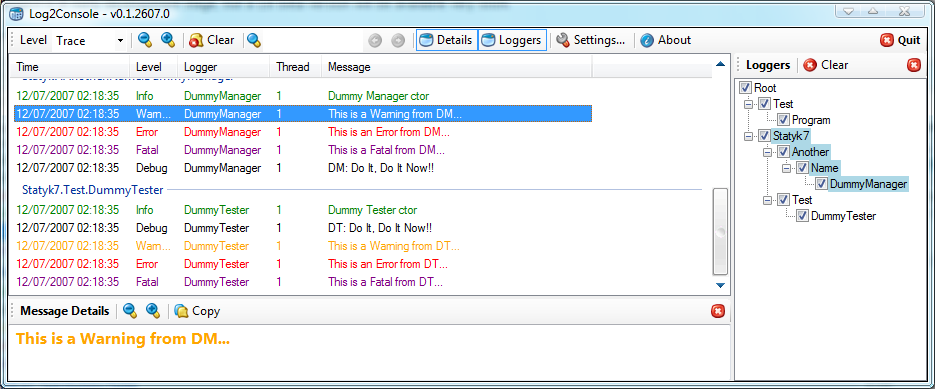

# Log2Console - .NET 8 Edition

## Project Description
Log2Console is a development tool offering a nice UI to display, filter and search log messages from different logging services: Log4Net, Log4j, NLog, and Serilog. It can directly receive log events locally or remotely, or read them from a log file. Originally created by **Rémy Baudet** and now upgraded to .NET 8 for modern compatibility.

## Version Information
- **Current Version**: 2.0.0 (.NET 8)
- **Original Creator**: Rémy Baudet (Statyk7)
- **Original Version**: 1.6.0.2 (.NET Framework 4.0)
- **Upgrade**: Migrated to .NET 8 with modern dependencies and improved performance (2025)

## What's New in .NET 8 Edition
- ✅ **Upgraded to .NET 8** for better performance and long-term support
- ✅ **Modern JSON-based settings** (replacing obsolete binary serialization)
- ✅ **Windows Compatibility Pack** for legacy Windows APIs
- ✅ **Conditional compilation** for features not available in .NET 8+
- ✅ **Maintained full backward compatibility** for configuration files
- ✅ **Enhanced Serilog support** with improved JSON formatting
- ✅ **Modern project structure** with SDK-style project files

## Main Features
- **View Remote Log Events**: Compatible with log4net, log4j, NLog, and Serilog receivers
- **Fully Customizable and Persistent Preferences**: UI and settings per Windows profile
- **Dynamic Filtering, Grouping, Cycling and Searching**: Real-time log analysis
- **Multiple Receiver Support**: Connect to multiple log sources simultaneously
- **Windows Integration**: Taskbar icons, progress indicators, and native Windows support
- **Cross-Framework Compatibility**: Works with .NET Framework, .NET Core, and .NET 5+ applications

## Supported Receivers
- **File** (Standard log or log4j XML format)
- **UDP** IPv4 and IPv6 (Compatible with log4j, NLog, and Serilog)
- **TCP** IPv4 and IPv6 (Primary for NLog and Serilog)
- **.NET Remoting** (Legacy support for log4net - .NET Framework only)
- **WinDebug** (OutputDebugString() receiver)
- **MSMQ** (Microsoft Message Queuing - .NET Framework only)
- **EventLog** (Windows Event Log)
- **CSV File** (Comma-separated values format)

## Quick Start with Serilog

### 1. Install Serilog UDP Sink
```bash
dotnet add package Serilog.Sinks.Udp
```

### 2. Configure Your Application
```csharp
using Serilog;
using Serilog.Formatting.Json;

Log.Logger = new LoggerConfiguration()
    .WriteTo.Console()
    .WriteTo.Udp("localhost", 7071, new JsonFormatter())
    .CreateLogger();

Log.Information("Hello from my .NET application!");
```

### 3. Configure Log2Console
1. Open Log2Console
2. Go to **Settings → Receivers**
3. Click **Add** → Select **UDP Receiver**
4. Set **Port**: `7071`
5. Click **OK** and **Start**

## System Requirements
- **Operating System**: Windows 10/11 (Windows 7+ supported)
- **.NET Runtime**: .NET 8 Desktop Runtime
- **Architecture**: x86, x64, ARM64

## Installation
1. Download the latest release from the output folder
2. Install the .NET 8 Desktop Runtime if not already installed
3. Run the Log2Console installer (MSI)

## Development
This project has been upgraded to use:
- **.NET 8 SDK** with Windows desktop support
- **Modern C#** language features
- **JSON serialization** for settings (System.Text.Json)
- **Windows Compatibility Pack** for legacy Windows APIs

## Building from Source
```bash
git clone [repository-url]
cd log2console
dotnet build src/LogFmwk.sln
```

## Legacy Information
- **Original Project**: Created by Rémy Baudet as an open-source Windows Forms application
- **Original License**: BSD License (see license.md)
- **Original Platform**: .NET Framework 2.0-4.0
- **Migration**: Carefully upgraded while preserving all original functionality

## Screenshots
_**More [Screenshots](docs/Screenshots.md) here**_



## Configuration Examples
- **[Serilog Configuration](docs/SerilogConfiguration.md)** - Modern .NET logging
- **[NLog Configuration](docs/NLog.md)** - Cross-platform structured logging
- **[Log4Net Configuration](docs/ClientConfiguration.md)** - Traditional .NET Framework logging

## License
BSD License - Copyright © Rémy Baudet 2007-2010, .NET 8 upgrade 2025

## Acknowledgments
- **Original Creator**: Rémy Baudet (Statyk7) for creating this excellent logging tool
- **Community**: All contributors who have helped improve Log2Console over the years
- **.NET Team**: For providing excellent upgrade paths and tooling for modern .NET

---

*Log2Console continues to be an essential tool for .NET developers, now with modern .NET 8 performance and compatibility.*

